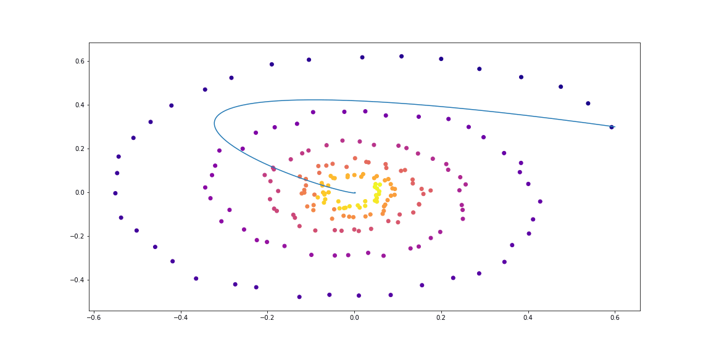
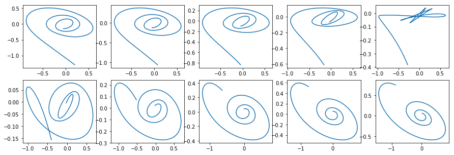

# Neural ODEs

[Link to the blog post](https://msurtsukov.github.io/Neural-ODE/)  

**For actual usage consider using authors [original implementation](https://github.com/rtqichen/torchdiffeq)**

# References

[[1]](https://arxiv.org/abs/1806.07366) Ricky T. Q. Chen, Yulia Rubanova, Jesse Bettencourt, David Duvenaud. "Neural Ordinary Differential Equations." Advances in Neural Processing Information Systems. 2018.
